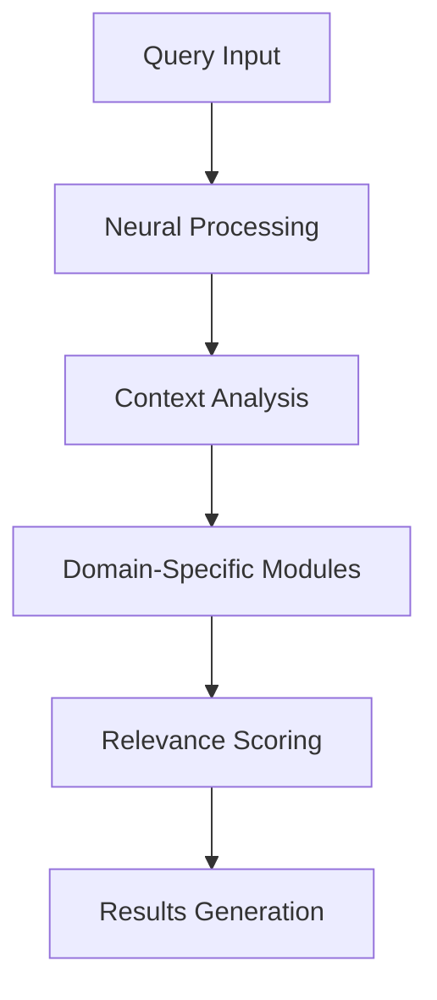

## Revolutionizing Search with Deepseek's Next-Generation AI

In today's data-driven world, finding meaningful insights shouldn't feel like searching for a needle in a digital haystack. **Deepseek's** revolutionary new AI model is transforming how we discover, analyze, and understand information. By combining cutting-edge algorithms with contextual intelligence, we're not just improving search—we're reimagining it.

## 🚀 The Evolution of Search Technology

Traditional search engines, built on keyword matching and link analysis, were perfect for the early internet. But today's digital landscape demands more:

- Exponential growth in online content
- Increasingly complex user queries
- Need for real-time information processing
- Demand for context-aware results

Deepseek's new AI model tackles these challenges head-on, delivering an experience that feels less like searching and more like having a conversation with a knowledgeable expert.

## 💡 Core Innovations

### Contextual Understanding
Our AI doesn't just process keywords—it comprehends meaning:

- **Natural Language Processing**: Understands nuanced queries and colloquialisms
- **Context-Aware Results**: Delivers information tailored to your specific needs
- **Domain Intelligence**: Adapts to different fields and specialties automatically

### Real-Time Processing
Stay ahead of the curve with:

- **Live Data Analysis**: Process and interpret information as it happens
- **Trend Detection**: Identify emerging patterns and developments
- **Dynamic Ranking**: Adjust result relevance based on current events

### Adaptive Learning
The system grows smarter with every interaction:

- **User Behavior Analysis**: Learn from search patterns and preferences
- **Feedback Integration**: Continuously improve based on user interactions
- **Pattern Recognition**: Identify and adapt to emerging search trends

## 🎯 Key Features That Set Us Apart

### 1. Neural Network Architecture


### 2. Multi-Domain Expertise
Our AI excels across various fields:

- 🔬 Scientific Research
- 📊 Business Analytics
- 📰 News and Media
- 🎓 Academic Studies
- 💻 Technical Documentation

### 3. Intelligent Summarization
Transform lengthy content into actionable insights:

- **Smart Summaries**: Get key points at a glance
- **Hierarchical Overview**: Drill down from high-level to detailed information
- **Custom Digest**: Tailored summaries based on your interests

## 🛠️ Technology Under the Hood

### Advanced Processing Pipeline

1. **Data Ingestion**
   - Real-time content processing
   - Multi-format support
   - Quality filtering

2. **Semantic Analysis**
   - Deep contextual understanding
   - Cross-reference verification
   - Pattern recognition

3. **Result Generation**
   - Personalized ranking
   - Relevance scoring
   - Dynamic updates

## 💪 Real-World Applications

### For Researchers
- Accelerate literature reviews
- Discover cross-disciplinary connections
- Track emerging research trends

### For Business Professionals
- Monitor market dynamics
- Analyze competitive landscapes
- Identify growth opportunities

### For Content Creators
- Source reliable information
- Verify facts and citations
- Uncover unique angles

## 🔮 Future Developments

### Coming Soon
1. **Enhanced Multimedia Analysis**
   - Video content understanding
   - Audio transcription and analysis
   - Image context recognition

2. **Advanced Integration**
   - API ecosystem expansion
   - Third-party tool compatibility
   - Custom workflow automation

3. **Predictive Intelligence**
   - Anticipatory research suggestions
   - Trend forecasting
   - Personalized insights

## 🚦 Getting Started

### Quick Start Guide

1. **Access the Platform**
   ```bash
   Visit: app.deepseek.ai
   Sign up for an account
   Choose your research domain
   ```

2. **Configure Your Experience**
   ```bash
   Set preferred topics
   Define search parameters
   Enable relevant notifications
   ```

3. **Begin Exploring**
   ```bash
   Start with a broad query
   Use filters to refine results
   Save and organize findings
   ```

## 🤝 Join the Revolution

Transform your research and discovery process with Deepseek's next-generation AI model. Experience the future of intelligent search today.

### Take the Next Step

- [Start Free Trial](https://deepseek.ai/trial)
- [Watch Demo](https://deepseek.ai/demo)
- [Join Community](https://community.deepseek.ai)

---

*Last updated: April 11, 2024*